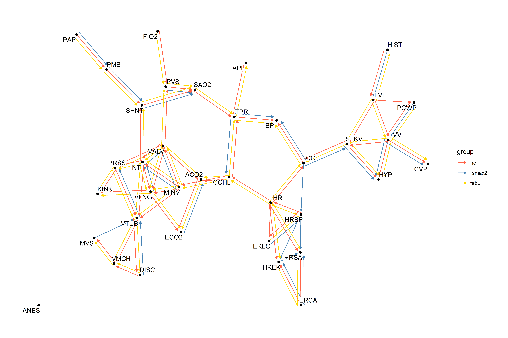

<!-- README.md is generated from README.Rmd. Please edit that file -->

# tidybn

Tidy manipulation and investigation of Bayesian network, using
`bnlearn`.

## Example

The `tbl_graph` is returned when the structure learning algorithms are
applied to `tbl_df` class. This could be useful when one want to compare
multiple algorithms run on the same dataset.

``` r
library(tidybn)
library(tibble)
library(tidygraph)
library(ggraph)

g1 <- tabu(as_tibble(bnlearn::alarm)) |>
  activate(edges) |> mutate(group="tabu")
g2 <- hc(as_tibble(bnlearn::alarm)) |>
  activate(edges) |> mutate(group="hc")
g3 <- rsmax2(as_tibble(bnlearn::alarm)) |>
  activate(edges) |> mutate(group="rsmax2")

Reduce(graph_join, list(g1,g2,g3)) |>
  ggraph()+
  geom_edge_parallel(
    aes(color=group),
    end_cap=circle(2,"mm"),
    arrow=arrow(length=unit(1.5,"mm"), type="closed"))+
  geom_node_point()+
  geom_node_text(aes(label=name), repel=TRUE, bg.colour="white")+
  scale_edge_color_manual(values=c("tomato","steelblue","gold"))+
  theme_graph()
```


